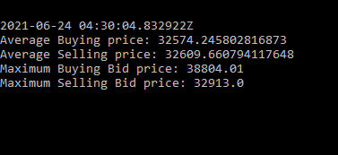

# Exchange

Read real time data from Coinbase websocket about the incoming requests to the exchange for buy and sell orders of Bitcoin and print the avg buy and sell price per 5 seconds to the screen on a command line application

## Usage

* Git clone the repo
* Fetch the dependencies and compile the app
`mix do deps.get, deps.compile, compile`
* Build and release the app
`MIX_ENV=prod mix release exchange`
* Start the application and get the live update which refreshes every 5 sec
`_build/prod/rel/exchange/bin/exchange start`

